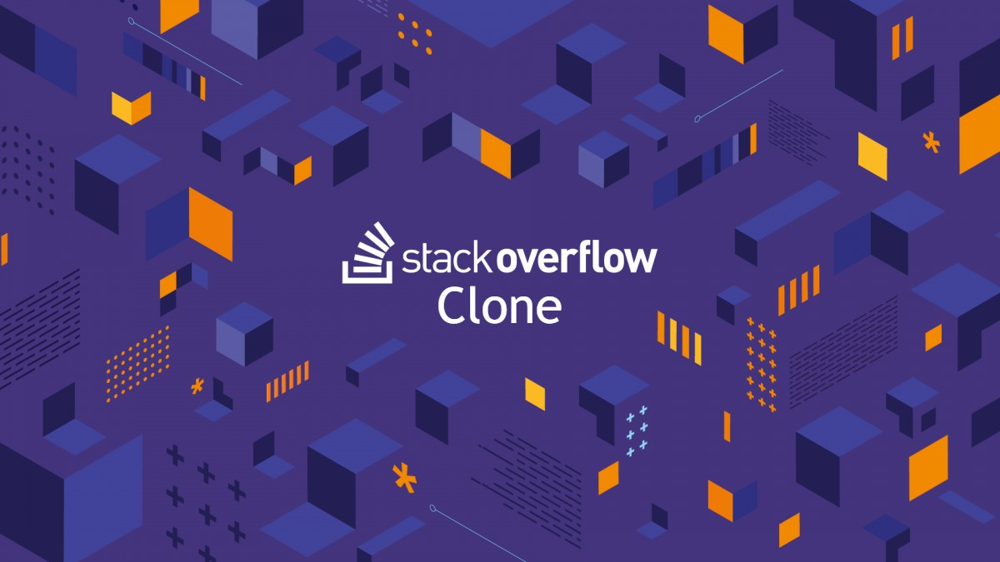

# Stack Overflow Clone



## Description

Discover a powerful Stack Overflow clone built on the MERN stack. Harness the potential of MongoDB, ExpressJS, ReactJS, and NodeJS, combined with advanced features like Axios, Redux, Redux-Thunk, React Hooks, CORS, and Context/RESTful API integration. Enjoy a seamless experience in a feature-rich environment for all your coding queries and discussions.

## Features

- MERN Stack Overflow Clone with MongoDB, ExpressJS, ReactJS, and NodeJS (MERN) stack.
- Backend powered by Node.js and Express.js for efficient server-side processing.
- MongoDB, a NoSQL database, handles data storage for user-generated content.
- Frontend uses React.js for dynamic and responsive user interfaces.
- React Hooks manage state and lifecycle events, enhancing code readability and reusability.
- Axios is employed for making API requests for communication between frontend and backend.
- CORS (Cross-Origin Resource Sharing) is utilized to handle cross-origin requests securely.
- Redux and Redux-Thunk manage application state and enable asynchronous actions.
- Context and RESTful API principles used for global state management and standardized data manipulation.
- Features include user registration and authentication, asking and answering questions, upvoting and downvoting answers, commenting, searching for questions, and more.
- The clone offers an intuitive user interface and powerful functionalities for both beginners and advanced users.

## Technologies Used

- [MongoDB](https://www.mongodb.com/): A NoSQL database used for persistent data storage.
- [ExpressJS](https://expressjs.com/): A backend framework facilitating the creation of scalable and modular RESTful APIs.
- [ReactJS](https://reactjs.org/): Forms the core of the user interface, enabling dynamic and interactive components.
- [Node.js](https://nodejs.org/): A server-side runtime environment for efficient handling of HTTP requests, database interactions, and business logic implementation.
- [Axios](https://axios-http.com/): A popular HTTP client for making API requests.
- [Redux](https://redux.js.org/): A state management library employed to handle global application state and provide a predictable and centralized data flow.
- [Redux-Thunk](https://github.com/reduxjs/redux-thunk): Middleware that enhances Redux functionality by enabling asynchronous actions for seamless integration with APIs and data fetching.
- [CORS (Cross-Origin Resource Sharing)](https://developer.mozilla.org/en-US/docs/Web/HTTP/CORS): Employed to enable secure cross-domain communication for integration with external APIs and services.
- [Context/RESTful API](https://restfulapi.net/rest-architectural-constraints/): Practices used for efficient data management and communication between components, ensuring a scalable and maintainable codebase.

## Getting Started

To run the Stack Overflow Clone locally, follow these steps:

1. Clone the repository to your local machine:

   ```bash
   git clone https://github.com/Mukesh-Sharma400/StackOverflow-Clone.git
   ```

2. Install all client side dependencies by navigating to the client's root directory and running the following command:

   ```bash
   npm install
   ```

3. Install all server side dependencies by navigating to the server's root directory and running the following command:

   ```bash
   npm install
   ```

4. Create a new .env file same as .env.example and assign the following environment variables.

5. Start the server side by running the following command into the server's root directory:

   ```bash
   npm start
   ```

6. Start the client side by running the following command into the client's root directory:

   ```bash
   npm start
   ```
